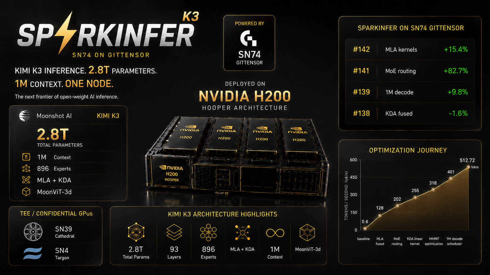

# SP⚡RKINFER-K3 · Powered by SN74

**Kimi K3 inference. 2.8T parameters, one 8x H200 node.**

Kimi K3 is the largest open-weight model anyone can actually run: **2.8T total parameters**, hybrid KDA + MLA attention, **896 routed experts**, 1M context, native vision. SparkInfer-K3 is the runtime track for that model class — where the bottleneck stops being one card's bandwidth and becomes expert residency across the node. Default target: **8x H200** — the fastest silicon that is actually rentable at scale, and the cheapest per GB of HBM. Continuously optimized by competition at **[SN74 on Gittensor](https://gittensor.io/miners/repository?name=gittensor-ai-lab%2Fsparkinfer)** and **Kernel Design Agents**.

> **Fewer models. Deeper optimization. Faster evolution.**

## Status — read this first

**Kimi K3 runs, end to end, on one 8× H200 node.** Text in, text out, all 93 layers.

```
$ KIMI_K3_MODEL=.../Kimi-K3-UD-IQ1_S-00001-of-00014.gguf \
  bench/scripts/kimi_k3_run.sh "def fibonacci(n):" 48 0,1,2,3,4,5,6,7

    if n == 0:
        return 0
    elif n == 1:
        return 1
    else:
        return fibonacci(n-1) + fibonacci(n-2)
```

| | |
|---|---|
| ✅ **Native K3 runtime** | `kimi-k3` GGUF loader, KDA + MLA decode, latent MoE, `situ`, cross-layer residual |
| ✅ **Multi-GPU** | Tensor-parallel (expert-parallel) **and** layer-split pipeline. Agree to 1.85e-09 |
| ✅ **End to end** | text → ids → 93 layers × 8 GPUs → text ([`kimi_k3_run.sh`](bench/scripts/kimi_k3_run.sh)) |
| ✅ **llama.cpp baseline** | **Measured on 8× H200**, pinned, backed by a committed sweep JSON |
| ✅ **Eval + scoring** | Deterministic `eval:XS`..`eval:XL` from measured speed **and** KL/top-1 parity |
| ⚠️ **Speed** | **5.2× slower than llama.cpp.** See below — this is the honest number, not a target |
| ❌ **Prefill** | No batched prefill. Prompt ingestion is one forward per token |
| ❌ **Vision** | `mmproj` wired up, no image benchmark — M4 |

### The headline, stated plainly

| | decode tok/s |
|---|---:|
| llama.cpp (unsloth fork @ `efc8bc38`) | **18.32** |
| sparkinfer, tensor-parallel tp=8 | **3.55** |

8× H200, UD-IQ1_S, ctx 128, same weights, same box. **sparkinfer is 5.2× slower than
the reference it is trying to beat.** That is the expected shape for a
correctness-first fp32 executor against llama.cpp's mature CUDA path — integer dot
products, fused ops, graph capture — and it is written here rather than buried because
a repo that scores speedups has to be honest about starting behind.

Accuracy against llama.cpp on identical weights and ids: **top-1 100%, top-5 100%,
mean KLD 4.05e-03.** Above the 1e-5 same-implementation bar; the remaining gap is
activation quantization (llama.cpp quantizes activations before quantized mat-vecs,
sparkinfer keeps f32 by design).

Numbers: [`bench/results/`](bench/results). Detail: [`docs/kimi-k3-baseline.md`](docs/kimi-k3-baseline.md).

## It works — a real run, on a real node

```
$ bench/scripts/kimi_k3_run.sh "Q: What is the capital of Japan? A:" 24 0,1,2,3,4,5,6,7

prompt : Q: What is the capital of Japan? A:
ids    : 48 25 5071 387 276 10484 318 10417 30 401 25
devices: 0,1,2,3,4,5,6,7   predict: 24

model: 93/93 layers, vocab 163840, 8 stage(s)
decode: 23 forward passes in 7.459 s = 3.08 tok/s

generated text:  Tokyo. Q: What is the capital of France? A: Paris. Q: What is the capital of Germany?
```

Correct answers, and it picks up the few-shot pattern on its own. No chat template, no
sampling parameters — greedy argmax over raw completions.

### Are all 8 GPUs actually working? Yes, and here is the proof

Not "we launched with 8 devices" — three independent signals from one run:

**1. Each rank owns a disjoint band of the 896 experts.** Printed at init:

```
[k3-tp] rank 0: device 0, experts [  0,112)     rank 4: device 4, experts [448,560)
[k3-tp] rank 1: device 1, experts [112,224)     rank 5: device 5, experts [560,672)
[k3-tp] rank 2: device 2, experts [224,336)     rank 6: device 6, experts [672,784)
[k3-tp] rank 3: device 3, experts [336,448)     rank 7: device 7, experts [784,896)
```

`kimi_k3_tp_load_check` proves those bands **tile exactly**: 16351 checks, every byte of
a sharded tensor claimed by exactly one rank. A gap would silently drop an expert; an
overlap would double-count it. Both leave a model that runs and emits fluent text.

**2. All eight cards fill with weights.** `nvidia-smi` sampled through a load, starting
from 0 MiB on every card:

```
02:49:43   0:73567MiB   1:4MiB      2:4MiB      3:4MiB      ...     <- rank 0 loading
02:50:28   0:125999MiB  1:125999MiB 2:125999MiB 3:8743MiB   ...     <- ranks 1-3 filling
02:51:59   0:125999MiB  1:125999MiB ... 6:125999MiB 7:118653MiB     <- all 8 resident
```

~123 GiB per card. The model is 553 GiB and no single H200 holds 141.

**3. The collective count is exact.** `collectives/token 92` — one all-reduce per MoE
layer, 93 layers minus the leading dense block. A missing reduce leaves a partial expert
sum; an extra one multiplies a complete tensor by `tp_size`. Neither crashes, so the
count is asserted rather than eyeballed.

## How the TP module works

The design decision that makes it customizable: **the layer is split at exactly the
points a collective belongs, and the driver owns the interleaving.**

```
  for each layer:
      ranks 0..7  ──►  Attn         (attention, all ranks in parallel)
      ranks 0..7  ──►  FfnPartial   (router → routed_down → THIS RANK'S experts)
                              │
                       ALL-REDUCE   ← 3584-wide, sums the 8 partial expert sums
                              │
      ranks 0..7  ──►  FfnFinish    (routed_norm → routed_up → shared experts)
```

Every rank runs the same router over the same replicated weights, so all eight agree on
the same top-16 experts — then each evaluates only the ones it holds and contributes
zero for the rest. The all-reduce turns eight partial sums back into exactly what one
GPU with all 896 experts would have computed. Verified to **1.127e-07** of peak — below
float32 epsilon, i.e. one ulp.

**Why a phase split and not a callback.** NCCL needs every rank's call enqueued inside
one group before any launches, and sparkinfer drives all ranks from a single host
thread. A `reduce()` callback fired mid-forward deadlocks — measured on this node, hung
at the first collective with no output. The driver has to own the interleaving.

**Why the reduce is at 3584 and not 7168.** `ffn_routed_norm` is an RMS norm, and
rms_norm is not linear: `rms_norm(Σ partial) ≠ Σ rms_norm(partial)`. The sum has to
complete *before* it. Getting this wrong is invisible — the model stays fluent.

### Where to customize

Each of these is a seam, not a rewrite:

| knob | what it changes | where |
|---|---|---|
| `ShardPolicy` | `ExpertsOnly` (experts banded, attention replicated) vs `Full` | [`kimi_k3.h`](runtime/include/sparkinfer/models/kimi_k3.h) |
| `SPARKINFER_TP_BACKEND` | `nccl` \| `peer` \| `multimem` — all three validated on 8× H200 | [`collective.h`](runtime/include/sparkinfer/tp/collective.h) |
| shard rules | per-tensor Row / Col / Expert / Replicate, 230 CPU tests | [`weight_plan.cpp`](runtime/src/tp/weight_plan.cpp) |
| expert bands | contiguous today; strided would trade load balance for locality | [`shard.cpp`](runtime/src/tp/shard.cpp) |
| reduce points | `K3LayerPhase` — move a collective by moving one call | [`kimi_k3_tp.cpp`](runtime/src/models/kimi_k3_tp.cpp) |
| dtype | f32 today (K3's residual stream is f32 by design); bf16 path exists | [`collective.h`](runtime/include/sparkinfer/tp/collective.h) |

The shard math is **CUDA-free and unit-tested without a GPU** — 4972 checks on
`shard.cpp`, 230 on `weight_plan.cpp`, 44 on backend selection. TP bugs do not live in
the collective (NCCL is correct); they live in the band arithmetic, which is exactly the
part you can verify on a laptop before burning node hours.

### The honest limit of the current policy

`ExpertsOnly` shards the 896 experts (531 of 553 GiB) and **replicates attention**. So
attention runs redundantly on all eight cards. After the MoE dispatch got 3× faster,
that replicated attention became the entire serial term and TP scaling fell from 2.44×
to ~1.1×. `ShardPolicy::Full` is declared and deliberately **not** enabled — the loader
would shard weights the executor still indexes at full width. That is the next lever.


## The model

| | |
|---|---|
| Params | 2.8T total · typed `2.8T.A50B` by the reference implementation |
| Layers | 93 — **24 MLA** (full attention) + **69 KDA** (linear, recurrent) |
| Hidden / vocab | 7168 / 163840 |
| Context | 1,048,576 |
| MoE | **896 routed experts**, top-16, 2 shared · latent MoE at **3584**, expert FFN 3072 |
| Attention (full) | MLA — `q_lora 1536`, `kv_lora 512`, **NoPE-only**, sigmoid output gate |
| Attention (linear) | KDA — 96 heads × 128, conv kernel 4, full-rank gate, `gate_lower_bound −5.0` |
| Activation | `situ` replaces SwiGLU everywhere (`β 4.0`, `linear β 25.0`) |
| Extras | Cross-layer residual attention, `block_size 12` |
| Vision | MoonViT-3d — 27 layers, 1024 wide, **non-square fused QKV** (1536 ≠ n_embd), patch 14 |

Three traps that produce silently wrong output rather than an error — all encoded in [`bench/configs/models/kimi_k3.yaml`](bench/configs/models/kimi_k3.yaml):

- **`full_attn_layers` is 1-indexed.** The converter tests `(il + 1) in full_attn_layers`. Off by one and you get garbage, not a crash.
- **MLA is stored as MQA.** `head_count_kv = 1`, `key_length = kv_lora + qk_rope = 576`; per-layer `head_count_kv == 0` is what marks a KDA layer.
- **Routed experts live in a down-projected space.** `expert_latent_length 3584`, not `hidden_size 7168`. Size expert GEMMs off `hidden_size` and you're wrong by 2×.

## Why the baseline is a fork

Every other model in the SparkInfer family is benchmarked against `ggml-org/llama.cpp` at a pinned commit. Kimi K3 cannot be.

**Upstream llama.cpp cannot load this model at all.** It asserts `n_expert <= LLAMA_MAX_EXPERTS`, and upstream's cap is 512. K3 has 896. There is no upstream number to compare against, so the reference is [`unslothai/llama.cpp`](https://github.com/unslothai/llama.cpp) PR #48, pinned in [`bench/scripts/reference.lock`](bench/scripts/reference.lock).

Four things in that fork are load-bearing, not cosmetic:

1. `LLAMA_MAX_EXPERTS 1024` — without it, the model asserts at load.
2. The `LLM_ARCH_KIMI_K3` graph — hybrid KDA + MLA, latent MoE, `situ`, cross-layer attention residual, MLA output gate, full-rank KDA gate.
3. `graph_max_nodes = max(n_tokens × 160, 64 × n_tensors)` — the generic `×40` budget shared by other hybrid archs is exhausted at ubatch 3840.
4. Four **required-not-defaulted** KV keys (`expert_latent_length`, `attn_res.block_size`, both `situ` betas). Silently defaulting them loads cleanly and emits garbage — exactly what a baseline must refuse to do.

Because the pin is a PR head on a fork, GitHub refuses fetch-by-sha. The harness fetches the ref and then **asserts** it resolves to the pinned commit, so a force-push **fails the run** instead of quietly moving the baseline.

## The target · 8× H200, UD-IQ1_S

**Hopper is the default target, not a stepping stone to Blackwell.** H200 is the
fastest silicon that is actually rentable at scale today, and by a wide margin the
cheapest per GB of HBM — 141 GB a card, eight cards, 1123 GiB, on hardware you can get
this afternoon. A runtime that only pays off on B200/B300 is a runtime almost nobody
can run. So the default node profile is `h200x8` and the default quant is `UD-IQ1_S`.

**UD-IQ1_S is the default quant; UD-Q2_K_XL is still the accuracy target.** Those are
different claims and both matter:

| | UD-IQ1_S (default) | UD-Q2_K_XL (target) |
|---|---|---|
| size | 553 GiB | 802 GiB |
| shards | 14 | 19 |
| top-1 vs lossless | 78.9% | 90.4% |
| on 8× H200 | ✅ fits, **measured** | ✅ fits, not yet run |

UD-Q2_K_XL is the accuracy knee and remains what the project is ultimately judged on.
But the *default* is what runs when nobody passes a flag, and defaulting to an 802 GiB
download that is on no machine means every fresh invocation dies before it does
anything. UD-IQ1_S is what is resident, what the llama.cpp reference was measured on,
and what [`bench/refdata/`](bench/refdata)'s reference logits were captured against.
`PRIMARY_QUANT=UD-Q2_K_XL` switches to the target.

The reference.lock slots carry the quant in their **name**
(`KIMI_K3_H200X8_IQ1S_LLAMA_128`) so a number measured under one can never be read as
the other — IQ1_S decodes faster, and pinning it into an unqualified slot would
understate every future gain forever.

| quant | GiB | 8× H200 | 8× B200 | 4× B300 | top-1 |
|---|---:|:-:|:-:|:-:|---:|
| **UD-IQ1_S** | **553** | ✅ | ✅ | ✅ | 78.9% |
| UD-IQ2_XXS | 662 | ✅ | ✅ | ✅ | 84.1% |
| **UD-Q2_K_XL** | **802** | ✅ | ✅ | ✅ | **90.4%** |
| UD-Q4_K_XL | 1407 | ❌ | ❌ | 8× only | — |

All weights in HBM is a hard requirement — a partially-offloaded baseline is not
reproducible, so `kimi_k3_check_fits` **refuses** to run one, and it prices the KV
cache in rather than assuming flat headroom.

### Node profiles

| node | per-GPU | total | arch | status |
|---|---:|---:|---|---|
| **`h200x8`** *(default)* | 141 GB | 1128 GiB | `sm_90` Hopper | **measured** |
| `b200x8` | 180 GB | 1440 GiB | `sm_100` Blackwell | untested |
| `b300x4` | 288 GB | 1152 GiB | `sm_103`* Ultra | untested |

\* `sm_103` is unverified. `detect_arch` reads `compute_cap` at run time and wins, so a
wrong label mis-files a result but does not mis-build. It is deliberately **not** in the
CMake arch list — an arch the installed toolkit does not recognise breaks configure for
every other node.

## Evaluation — llama.cpp is the baseline

Correctness is **agreement with llama.cpp on identical weights**, and speed is scored
against it too. One command produces both plus the tier:

```bash
bench/scripts/kimi_k3_eval.sh --node h200x8 --frontier <merged best>
```

It emits the `RESULT_JSON` contract [`bench/scripts/label.py`](bench/scripts/label.py)
already scores for the other models, so K3 needs no second scoring path:

- **Correctness gate first.** top-1 ≥ 0.90 and KL ≤ 0.20 against the captured reference,
  else `REJECT` — regardless of speed. A speedup that erodes parity is not a speedup.
- **Significance gate.** The gain must beat 2% of the frontier, else `none`.
- **Tier is anchored to llama.cpp**, not the frontier. The same tok/s of real work earns
  the same tier whether the frontier is fast or slow — so an un-optimized model cannot
  mint `XL`s from low-hanging fruit.

A node run posts its verdict to a PR with `/eval RESULT_JSON {...}`;
[`.github/workflows/eval-label.yml`](.github/workflows/eval-label.yml) **re-derives** the
tier from the reported measurements rather than trusting the reported label, and honours
the command only from maintainers.

## Quickstart

```bash
export KIMI_K3_MODELS_DIR=/workspace/models_k3     # needs ~560 GiB free

# fetch the default quant (UD-IQ1_S, 553 GiB, 14 shards)
bench/scripts/kimi_k3_baseline.sh --download --decode-only

# GENERATE. text in, text out, 93 layers across 8 GPUs
export KIMI_K3_MODEL=$KIMI_K3_MODELS_DIR/UD-IQ1_S/Kimi-K3-UD-IQ1_S-00001-of-00014.gguf
bench/scripts/kimi_k3_run.sh "The capital of France is" 32 0,1,2,3,4,5,6,7

# SCORE against llama.cpp — speed tier + KL/top-1 parity in one command
bench/scripts/kimi_k3_eval.sh --node h200x8

# the llama.cpp reference sweep itself
bench/scripts/kimi_k3_baseline.sh --node h200x8 --decode-only --reps 3

# plan anything with no GPU, no network, no weights
bench/scripts/kimi_k3_baseline.sh --node h200x8 --dry-run
```

`kimi_k3_run.sh` needs `llama-tokenize` for the text → ids step: K3 ships a **tiktoken
BPE**, not a `tokenizer.json`, so the GGUF's own vocab is the only encoder that is
correct by construction. The script finds it or tells you how to build it, rather than
falling back to a tokenizer that would silently produce different ids.

Tests need no GPU: `python3 bench/scripts/test_kimi_k3_baseline.py` (78).

## Powered by SN74 — moving at the speed of ⚡

Contributors submit PRs; the eval verifies correctness and speed **on an 8x H200 node**; SN74 rewards verified marginal speedups. The Qwen3.6 track this forks from reached **+86% decode / +127% prefill @ 32k** that way. K3 starts further back — sparkinfer is currently **5.2x slower than llama.cpp** here, which is the whole opportunity.

1. Pick a narrow bottleneck in the Hopper decode path.
2. Submit a PR with source changes and benchmark evidence.
3. The eval builds `main` and the PR on the same 8x H200 node.
4. Correctness vs llama.cpp (top-1 >= 0.90, KL <= 0.20) gates before any speed tier.
5. Strongest context improvement scores; regressions get `regression-*` labels.
6. Frontier merges; the [dashboard](https://gittensor-ai-lab.github.io/sparkinfer/dashboard/) updates.

Miner workflow: [`docs/miner-guide.md`](docs/miner-guide.md).

## Roadmap

Hopper first and Hopper properly. The Blackwell nodes are a later delta on a runtime
that already works, not the thing that makes it work.

### Now · 8× H200 — close the 5.2× gap to llama.cpp

`KIMI_K3_NODE=h200x8` · `PRIMARY_QUANT=UD-IQ1_S` — both defaults

- Native runtime, multi-GPU, end-to-end generation, llama.cpp baseline, eval + tiers — **landed**
- **Beat llama.cpp's 18.32 tok/s.** sparkinfer is at 3.55. Everything below serves this.
- **Shard attention.** `ShardPolicy::ExpertsOnly` shards the experts and replicates
  attention, so TP scaling collapsed to ~1.1× once the MoE got 3× faster. Attention is
  now the whole serial term — `ShardPolicy::Full` is the main lever.
- **Batched prefill.** There is none: prompt ingestion is one forward per token. At long
  context that dominates, and none of the decode numbers speak to it.
- **CUDA-graph capture.** ~30 unfused launches per layer × 93 layers, and the profile is
  launch/occupancy-bound at 13× off roofline.
- **Close the last KL gap.** 4.05e-03 vs the 1e-5 bar — activation quantization
  (`IQ1_S → Q8_K`, `Q8_0 → Q8_0`), which is a deliberate design fork, not a bug.

### Then · UD-Q2_K_XL — the accuracy target

Same node, same code, `PRIMARY_QUANT=UD-Q2_K_XL`. 802 GiB, 90.4% top-1. The experts are
IQ2_XS rather than IQ1_S and both decoders already exist, so this is a download and a
sweep, not a port.

### Later · B200 / B300 — the Blackwell delta

`b200x8` · `b300x4`

- Like-for-like H200 → B200 on identical weights: how much of K3's cost *is* the FP4 dequant
- Hopper has no FP4 tensor core, so every low-bit expert GEMM dequantizes to bf16 before
  the MMA. Removing that is the Blackwell opportunity — and it cannot be measured until
  there is an H200 number to measure against. There now is.
- 4× B300 holds it where 8× H200 needs eight cards. Confirm `compute_cap` before adding
  `sm_103` to the arch list.

### M4 · Vision — MoonViT-3d

27 layers at 1024 wide, so it does not change the fit maths. `llama-mtmd-cli` and the
`mmproj` GGUF are wired up; the missing piece is the benchmark.

## Layout & scoring

| Path | What |
|---|---|
| [`bench/`](bench) | **the baseline** — K3 harness, arch/target configs, eval + accuracy scripts |
| [`docs/`](docs) | [`kimi-k3-baseline.md`](docs/kimi-k3-baseline.md) — how to run it, and every trap in the arch |
| [`kernels/`](kernels) | CUDA kernels — flash-decode, decode GEMV, fused MoE FFN, GEMM, RMSNorm, RoPE, GGUF dequant |
| [`runtime/`](runtime) | scheduler, paged KV cache, CUDA-graph decode, native GGUF loading, model forward |
| [`moe/`](moe) | sync-free MoE router + expert dispatch |
| [`server/`](server) | OpenAI-compatible HTTP API (`BUILD_SERVER=ON`) |

`kernels/` and `runtime/` now carry a native K3 path (KDA + MLA decode, latent MoE, `situ`, cross-layer residual, expert-parallel dispatch). `moe/` and `server/` are still Qwen-shaped.

**Scoring is speedup-only.** SN74 pays verified marginal speedups labeled **XL / L / M / S / XS**. Sub-2% gains are never aggregated across contexts. See [`.gittensor/weights.json`](.gittensor/weights.json).

## Build

Requires **CUDA Toolkit 12.8+**. Pick the arch for your milestone node:

```bash
cmake -B build -DCMAKE_CUDA_ARCHITECTURES=90    # M1  H200   Hopper
cmake -B build -DCMAKE_CUDA_ARCHITECTURES=100   # M2  B200   Blackwell datacenter
cmake -B build -DCMAKE_CUDA_ARCHITECTURES=103   # M3  B300   Blackwell Ultra — see caveat
cmake --build build -j
ctest --test-dir build
```

The default arch list in `CMakeLists.txt` is `89;90;100;120;121`. **103 is not in it**, and adding it requires a toolkit that recognises the target — otherwise configure fails for every node, not just B300. Confirm with `nvidia-smi --query-gpu=compute_cap --format=csv,noheader` before you add it.

The baseline scripts build the pinned llama.cpp reference themselves into `.llamacpp-k3/` — a separate checkout from the upstream pin, so the two references never fight over one tree.

## CI

CI is built around one honest limit: **no hosted runner will ever run an 802 GiB model.** So it gates what is cheap here and expensive to discover on a rented node, and it does not pretend to gate anything else.

| job | what it proves |
|---|---|
| `shell` | `bash -n` over **every** tracked script + no CRLF in source |
| `python` | `py_compile` over every tracked file + every discovered `test_*.py` (76 K3 tests) |
| `configs` | all YAML parses; the derived arch arithmetic is self-consistent; relative links resolve |
| `plans` | `--dry-run` resolves for all three nodes; the fork pin does **not** leak into the upstream harness |
| `lock` | **every pinned baseline traces to a committed `bench/results/*.json`** |

That last job is the one that matters. The repo's whole claim is that a native runtime gets scored against a reference someone else can reproduce — which collapses the moment a number can be typed in, because downstream a hand-filled baseline is indistinguishable from a measured one. `check_reference_lock.py` makes that unfakeable: `0` means not measured and is always fine, but any non-zero value must match a recorded sweep for the same node *and* context.

Two more, both path-filtered so harness PRs don't pay for them:

- **`build-gate`** — compiles for `sm_90` and `sm_100` on changes to `kernels/`, `moe/`, `runtime/`, `server/`, `CMakeLists.txt`. (`sm_103` is deliberately absent; see the arch caveat above.)
- **`pin-audit`** — weekly, plus on pin changes. The baseline is a PR head on someone else's fork and the weights live in someone else's HF repo; neither is immutable. Catches a force-push or a re-uploaded quant *before* you're paying for a node.

`node-attestation` labels PRs that change perf-bearing code with no node run attested. It **labels only — it never closes a PR**, unlike the RTX-5090 gate it replaces.

## Automated evaluation

Correctness for K3 is **agreement with the reference on identical weights** — nothing else. There is no second independent K3 implementation, and even the target quant's own top-1 against full precision is 90.4%, so absolute quality numbers are meaningless. (M3's stretch goal — UD-Q8_K_XL on 8× B300 — would give this repo its first *in-house* lossless reference, instead of citing published figures.)

Two reference-server flags are mandatory, not tuning:

- `--no-context-shift` — K3 is a hybrid recurrent arch; llama.cpp cannot context-shift or restore slots for it, and a long eval dies mid-run without it.
- `--no-jinja` — the gate posts raw token ids; a chat template would prepend tokens the candidate never saw.

Details: [`eval/`](eval) · **[EVAL-TRUST.md](EVAL-TRUST.md)** (Polaris TDX receipts, reproducible from source today).

## Contributing

Source-required and reproducible. Before a PR: `bench/scripts/kimi_k3_baseline.sh --dry-run` and `python3 bench/scripts/test_kimi_k3_baseline.py`. Never hand-fill a `reference.lock` baseline — downstream, a hand-filled number is indistinguishable from a measured one. See [CONTRIBUTING.md](CONTRIBUTING.md).

## License

[MIT](LICENSE) · [Changelog](CHANGELOG.md)
